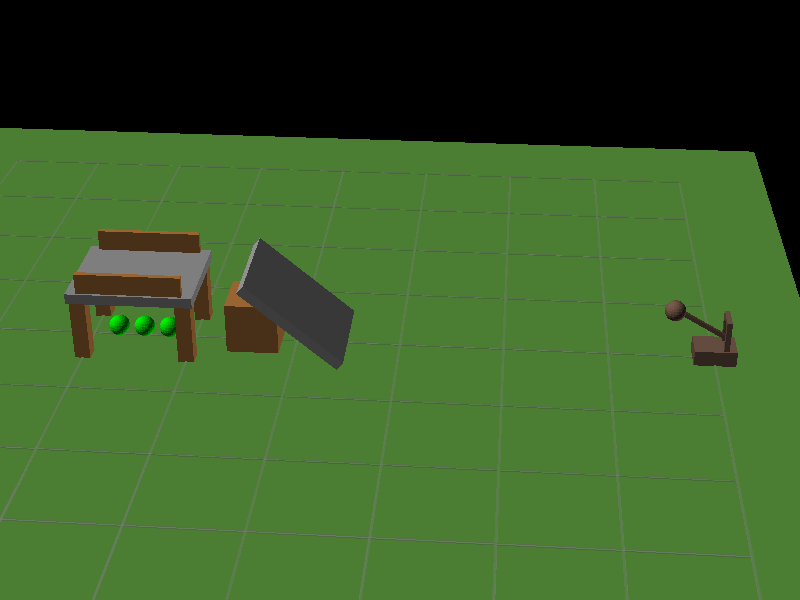
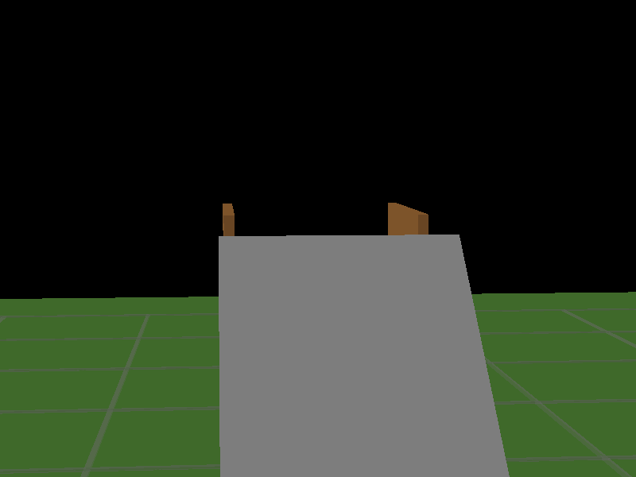
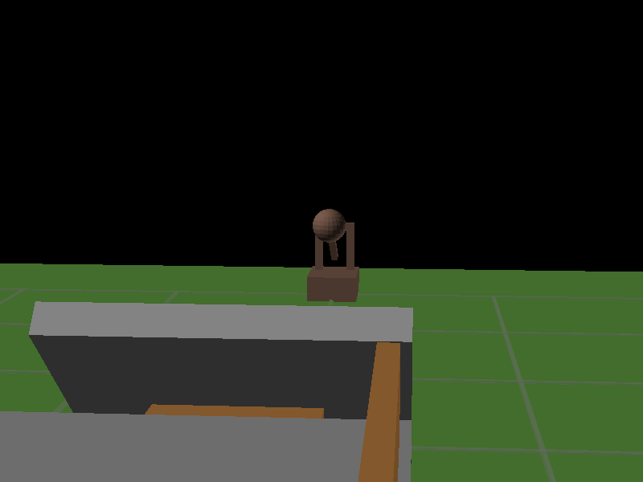
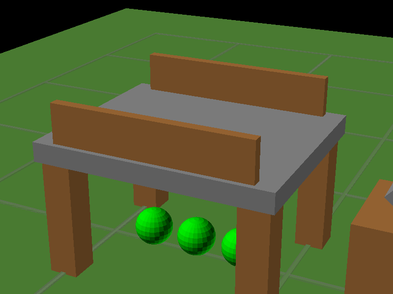
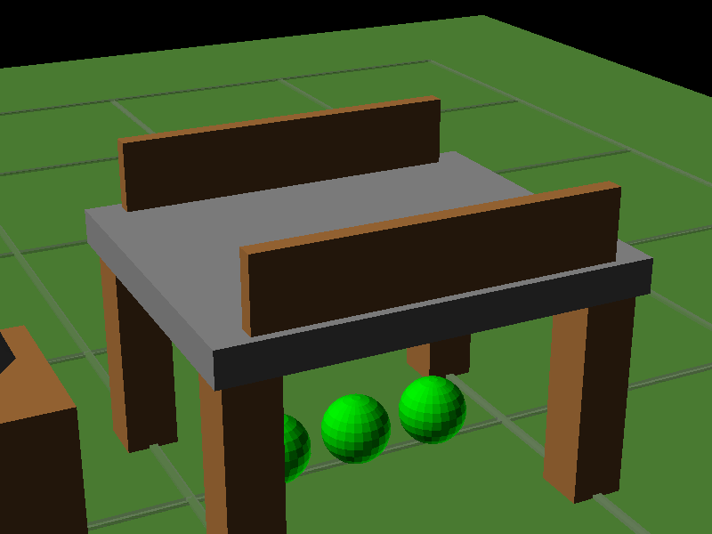
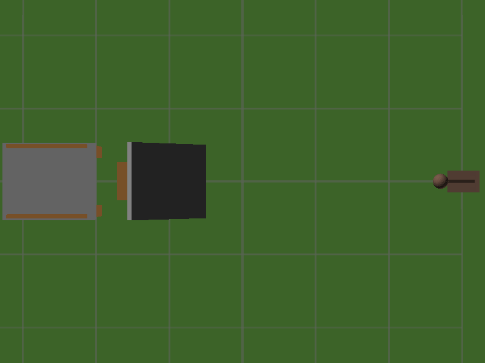

# MeshBenchmark

A benchmark suite for evaluating AI model performance on geometry and spatial reasoning tasks.

MESH stands for Model Evaluation of Spatial Hueristics.

## Results

**[View Latest Benchmark Results →](https://ashleyharris-maptek-com-au.github.io/MeshBenchmark/results/index.html)**


Some of the best results broken down by test:

- [Gemini 3 Pro (w/ reasoning, Web & Python)](https://ashleyharris-maptek-com-au.github.io/SpatialCompetenceBenchmark/results/models/gemini-3-pro-preview-Reasoning-Tools/report.html)
- [ChatGPT 5.1 High (w Web & Python)](https://ashleyharris-maptek-com-au.github.io/SpatialCompetenceBenchmark/results/models/gpt-5.2-HighReasoning/report.html)

**[Breakdown by test and per-test details →](https://ashleyharris-maptek-com-au.github.io/SpatialCompetenceBenchmark/results/index.html)**

## What We're Measuring

This benchmark evaluates how well AI models can "picture things" in working memory, such as foreseeing
how objects fit together, interact, move, or flow.

Examples include:

- Playing 1 player visual games, such as [Tetris(tm)](https://ashleyharris-maptek-com-au.github.io/SpatialCompetenceBenchmark/results/index.html#q15) or [Bejewelled(tm)](https://ashleyharris-maptek-com-au.github.io/SpatialCompetenceBenchmark/results/index.html#Q27) or [Angry Birds(tm)](https://ashleyharris-maptek-com-au.github.io/SpatialCompetenceBenchmark/results/index.html#Q48)
- Planning a [rollercoaster ride](https://ashleyharris-maptek-com-au.github.io/SpatialCompetenceBenchmark/results/index.html#q21) that isn't lethal.
- Creating a [maze in 3D](https://ashleyharris-maptek-com-au.github.io/SpatialCompetenceBenchmark/results/index.html#q7) which requires jumps and stair climbs, or [solving a maze from close up photos](https://ashleyharris-maptek-com-au.github.io/SpatialCompetenceBenchmark/results/index.html#Q43).
- Catching and [redirecting water](https://ashleyharris-maptek-com-au.github.io/SpatialCompetenceBenchmark/results/index.html#q23) within a voxel map.
- [Stacking 3D printable digits](https://ashleyharris-maptek-com-au.github.io/SpatialCompetenceBenchmark/results/index.html#q30) on top of each other without them sagging, or designing [complex interlocking 3D printable parts](https://ashleyharris-maptek-com-au.github.io/SpatialCompetenceBenchmark/results/index.html#Q29).
- [Travelling salesman in orbit](https://ashleyharris-maptek-com-au.github.io/SpatialCompetenceBenchmark/results/index.html#q22), or [navigating by the stars](https://ashleyharris-maptek-com-au.github.io/SpatialCompetenceBenchmark/results/index.html#Q45).
- Modelling shadows.
- Working with quaternion rotations.
- Concepts like "hidden behind" or "falling"

## Example tests

### Prompt

You are controlling a catapult to destroy a structure and its targets.

**Scene Description:**
A bridge with targets hiding underneath - requires indirect hits

**Targets to destroy (green spheres):**

- target_under_center at position (3.0, 0.0, 0.3)
- target_under_front at position (2.5, 0.0, 0.3)
- target_under_back at position (3.5, 0.0, 0.3)

**Catapult Position:** (-8.0, 0.0, 0.0)
The catapult is located to the WEST of the structure (negative X). The structure is centered around X=3.

**Physics:**

- Projectiles are spheres with radius 0.3m and mass 5.0kg
- Gravity is 9.81 m/s²
- Targets must be displaced by at least 0.5m to count as destroyed

**Your Task:**
Provide exactly 3 shots. For each shot, specify:

1. **bearing** (degrees): Horizontal aim angle. 0° = straight toward +X (toward structure), positive = left (+Y direction)
2. **elevation** (degrees): Vertical angle above horizontal. Range: 5° to 75°
3. **speed** (m/s): Launch speed. Range: 5 to 30 m/s

**SCENE IMAGES:**
**1. Overview (side view of entire field):**

**2. Catapult's View (looking from catapult toward structure):**

**3. Behind Structure (looking back at catapult):**

**4. Structure Close-up (front-left angle):**

**5. Structure Close-up (front-right angle):**

**6. Top-Down View (aerial view of field):**



### LLM returns (structured JSON, following a provided schema)

```json
{'shots': [
  {'bearing': 0, 'elevation': 40, 'speed': 10.65}, 
  {'bearing': 0, 'elevation': 35, 'speed': 10.69}, 
  {'bearing': 0, 'elevation': 30, 'speed': 11.43}
]}
```

### Which, using Python, pyBullet physics engine and OpenSCAD, is converted into


This shows that it didn't understand the scene at all. It understood the physics of the problem, calculating 3 good ballistic arcs, as it's training data likely included physics
textbooks with very similar problems, and it has access to calculators to plug in the
numbers, but it doesn't understand the geometry of the scene.

## Setup

### Prerequisites

- Python 3.10+
- [OpenSCAD](https://openscad.org/) (required for 3D geometry tests)
  - If OpenSCAD is not on your PATH, set `OPENSCAD_PATH` to the full path of the `openscad` binary.
  - Prefer nightly build as performance is 100x better.

### Installation

```bash
# Clone the repository
git clone https://github.com/ashleyharris-maptek-com-au/MeshBenchmark.git
cd MeshBenchmark

# Install dependencies
pip install -r requirements.txt

# Optional, but the first run builds reference models / downloads assets.
# Expect 1gb of data transfer / 10 mins of building. This allows you to 
# use --parallel later.
python TestRunner.py --setup
```

### API Keys

Set environment variables for the AI providers you want to test:

```bash
# OpenAI
export OPENAI_API_KEY="your-openai-key"

# Anthropic
export ANTHROPIC_API_KEY="your-anthropic-key"

# Google Gemini
export GEMINI_API_KEY="your-google-genai-key"

# XAI Grok
export XAI_API_KEY="your-xai-grok-key"

# Amazon Bedrock
export AWS_ACCESS_KEY_ID="your-aws-access-key"
export AWS_SECRET_ACCESS_KEY="your-aws-secret-key"
export AWS_DEFAULT_REGION="your-aws-region"

# Self hosted models
export LLAMACPP_BASE_URL=http://localhost:8080
export LLAMACPP_MODEL_NAME="deepseek-v2.5"
```

OpenAI and Gemini should be considered 'required' and all others 'optional'. The reason
being some tests use AI to interpret results, and, since I don't trust one AI to mark
it's own homework, it will use Gemini to mark Chatgpt's output, and Chatgpt to mark all others.

## Running the Benchmark

### Run all configured tests

```bash
# Get an overview of available options:
python TestRunner.py --help
```

This will allow you to see available options, including model and test selections.

To run EVERYTHING:

```bash
python TestRunner.py --parallel
```

THIS Will run EVERYTHING. This will:

1. Run tests against all configured AI engines
2. Generate HTML reports in `results/`
3. Create comparison charts and a landing page at `results/index.html`
4. Take at least 24 hours. Or 7-10 days without "--parallel"
5. Randomly redline your machine. My PC has 128gb and 64 core and the cursor freezes for multiple seconds under this load.
6. Burn a $250 minimum hole in your wallet.

To help keep costs down, caching is used to store responses from previous runs. These expire on the 1st of each month, and you can ignore the cache with --force argument.

## Scoring guidelines

- "Service not available", "Service over capacity", "Error 500 try again" is retried 3 times before declaring a failure. Will score a 0 but will be reattempted next run.
- Taking over an hour to respond to an API call 3 times (so 3 hours total) is considered a failure.
- Violating JSON schemas is considered a failure, and after 3 retries it scores 0. This is why some LLMs degrade in performance when tools are added, as they loose structured validation. This is a weakness of the LLM and should be reflected in the scoring.
- "This violates our content policy" is considered a **dismal failure**, as nothing in here is risqué. If an LLM thinks "jumping near heights" (Q7, 3d maze) or "Planting explosives" (Q28, terrain flattening) is banned, that's a well deserved 0 for it. I'm pointing and laughing. To avoid permabanning, a prompt is never repeated when this is seen, and the failure prompt hash is committed to the repository in a *hall of shame*, resulting in a well-earned eternal 0 score. Fix your guardrails.
- "Score of 1000/1" is used to indicate a test framework failure, as it should stand out in the graph clearly.
- Not answering the question directly, but instead responding with clarification questions is considered a failure. 99% of the time when LLMs do this it's because they are either overwhelmed or not understanding the problem. Be alert to
opportunities to improve the prompt if confusion seems genuine however.

## What motivated this benchmark

Trying to get AI to plan 3D builds has been fraught with failure, the reasoning loops can not "picture"
things, and that causes them to confidently spit out bad results to tasks requiring spatial reasoning.

Some that I personally saw:

- ChatGPT deep resaerch planned a brick fireplace build for me that had inconsistant dimensions.
- Claude code struggling with a block-model slicing algorithm.
- Gemini Deep Research planned an arcology for a sci-fi setting that had support legs with centres 500m apart, with a diameter of 3km.
- Planning pipe-joiner projects (think a supermarket trolley bay) results in assembly instructions and BOMs that
don't match.
- Asking it for help with 3D printing part design was a waste of time.

As a C++ dev primarily working with 3D graphics, having a powerful AI assistant to help with coding is wonderful, but
if it didn't have aphantasia that would be excellent.

## Explain the "Human-with-tools" model?

This is me trying to solve the problems, with every tool at my disposal. This was originally used to confirm the graders
were working correctly, but I decided to keep it as a reference point.

I'm not the smartest human there is - but I think I'm a decent contender.

"Tools" include everything humanity has invented and made available to me, including special tools, the AIs, and whatever compute, memory, spare time, and other resources a 39yr old geek can spare.

## Bill shock protections

The benchmark framework has protections to save your wallet, which need to be acknowledged in any research drawn from these results. The following compromises are made:

- Early fail:
  - Assuming failure of hard tasks if easy tasks are failed. This is call EarlyFail, and can be configured per test.
  - If you can't lay out 4 pipes in a square or 3 pipes in a triangle, you're not going to be able to lay out 400 pipes in the shape of a world map.
  - Early fail can be configured to sample multiple early runs, or have adjustable thresholds per test.
  - This only works when tests are configured that the early subpasses are easiest, so it's opt-in.
  - This can be turned off with --no-early-fail
- Propagation upwards:
  - Assuming a model can ace a test without tools or reasoning, assume that it will also pass with tools or reasoning.
  - If version 3 of the model can ace a test, assume that version 4 also can.
  - This works by sorting models based on capability, and propagating results between models with the same prefix.
- API instability lock out:
  - If the API fails 9 times in a row, assume it will fail again for the rest of the run.
  - This can stop a run wasting days retrying when you've hit a spend limit or the network goes down.
- Double caching:
  - Results are cached in your temp directory and in the git repo.
  - This allows runs performed on one machine to be used by another machine to save costs.
- Eternal caching:
  - Original design was for results to only be cached for a month, however the realities of API costs got in the way.
  - You can turn this off by disabling POOR_MODE in CacheLayer.py

## License

MIT

## Future tests for V2 of the benchmark

- Track / via routing on a PCB layout.
- Driving a 3D printer head to create a shape.
- A rotating cylinder of wood, and you control a laser beam that blasts wood away. Make a hollow lampshade. (Only possible if you build it at a 90 degree angle.)
- A fair dice is dropped from ... at an orientation and angular momentum of ..., position cubes such that
it always lands on a 6.
- Using pipes and offest crosses only, create a shape that supports a ragdoll in this pose.
- Here is a 3D mesh of a socket, design a connector that plugs into it.
- Partition a standford bunny into two peices, both that can be 3D printed, and when
  assembled, click together with a snap with no visible seam.
- Arrange 500 dominos so that when pushing over a single one, in a direction you
  choose, they fall over in a pattern that resembles a unit hypercube
  projected into 2D from the 4D camera location 10,10,10,10.
- How many stanford bunnies can you fit into a 1 cubic meter box?
- Puzzle 6 from <https://youtu.be/DstlphyqyNw?si=w0LirzJ4xk38cWrI&t=1362>. Which Presh solves for the general case for odd
cases, or even non-regular cases, and links to a paper solving the even case.
- Can you scan a barcode?
- Constraints solver - like what freeCAD can do in sketch mode. Eg point1 and point2
  must be on circle1, line 1 connects points 1 and 2. Point 3 must be 7m meters from point 1.
  What is the radius of circle 1? That sorta thing.
- Trace the coastlines of (Australia?) using only these 3 operations. WalkNKm, TurnLeftNDegrees, TurnRightNDegrees
