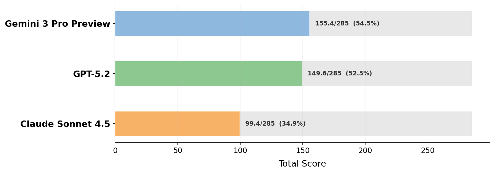

# Spatial Competence Benchmark

A benchmark suite for evaluating AI model performance on geometry and spatial reasoning tasks.

## Results

**[Paper Summary Chart (combined) →](results/experiments/benchmark_summary/benchmark_results.png)**



Paper-model reports (tools):

- [Claude Sonnet 4.5 (Tools)](results/models/claude-sonnet-4-5-Reasoning-Tools/report.html)
- [Gemini 3 Pro Preview (Tools)](results/models/gemini-3-pro-preview-Reasoning-Tools/report.html)
- [GPT-5.2 (Tools)](results/models/gpt-5.2-Reasoning-Tools/report.html)

**[No-tools chart →](results/experiments/benchmark_summary/benchmark_results_no_tools.png)**

## Setup

### Prerequisites

- Python 3.10+
- [OpenSCAD](https://openscad.org/) (required for 3D geometry tests)
  - If OpenSCAD is not on your PATH, set `OPENSCAD_PATH` to the full path of the `openscad` binary.

### Installation

```bash
# Clone the repository
git clone <REPO_URL>
cd SpatialCompetenceBenchmark

# Install dependencies
pip install -r requirements.txt

# Optional, but the first run builds reference models / downloads assets.
# Expect 1gb of data transfer / 10 mins of building. This allows you to 
# use --parallel later.
python TestRunner.py --setup
```

### API Keys

Set environment variables for the AI providers you want to test:

```bash
# OpenAI
export OPENAI_API_KEY="your-openai-key"

# Anthropic
export ANTHROPIC_API_KEY="your-anthropic-key"

# Google Gemini
export GEMINI_API_KEY="your-google-genai-key"

# XAI Grok
export XAI_API_KEY="your-xai-grok-key"

# Amazon Bedrock
export AWS_ACCESS_KEY_ID="your-aws-access-key"
export AWS_SECRET_ACCESS_KEY="your-aws-secret-key"
export AWS_DEFAULT_REGION="your-aws-region"
```

OpenAI and Gemini should be considered 'required' and all others 'optional'. The reason
being some tests use AI to interpret results, and, since I don't trust one AI to mark
it's own homework, it will use Gemini to mark Chatgpt's output, and Chatgpt to mark all others.

## Running the Benchmark

### Run all configured tests

```bash
# Get an overview of available options:
python TestRunner.py --help
```

This will allow you to see available options, including model and test selections.

To run EVERYTHING:

```bash
python TestRunner.py --parallel
```


## License

MIT
